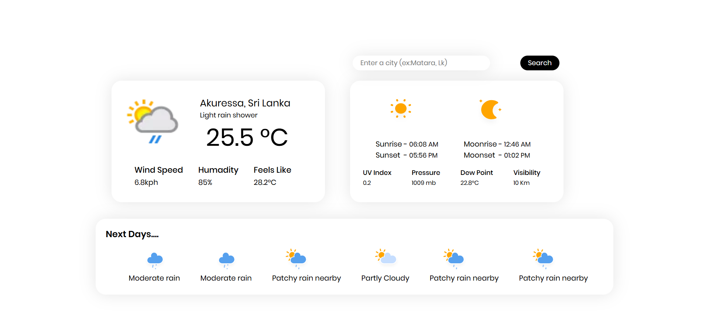

# 🌦️ Weather App (React.js)

A simple and responsive **Weather Application** built using **React.js** that allows users to search for a city and view real-time weather information. This project was created as a learning project while exploring React concepts such as components, state management, API fetching, and conditional rendering.

---

## 🚀 Features

* 🌍 Search weather by city name
* 🌡️ Display current temperature
* ☁️ Weather condition (clear, cloudy, rain, etc.)
* 💧 Humidity and wind speed
* 🌅 Sunrise and 🌇 sunset times 
* 🔄 Live data fetched from a weather API

---

## 🛠️ Built With

* **React.js** – Frontend framework
* **JavaScript (ES6+)**
* **HTML5 & CSS3**
* **Weather API** (e.g., WeatherAPI / OpenWeatherMap)

---

## 📸 Screenshots

---

## 🧠 What I Learned

* React components and props
* Using `useState` and `useEffect`
* Fetching data from APIs
* Handling loading and error states
* Basic project structure in React

---

## 🔮 Future Improvements

* 🌍 Auto-detect location weather
* 📅 7-day weather forecast
* 🌙 Dark / Light mode
* 🕒 Hourly forecast

---

## 🤝 Contributing

Contributions, issues, and feature requests are welcome!

---

## 📄 License

This project is open-source and available under the **MIT License**.

---

## 🙌 Acknowledgements

* React Documentation
* Weather API providers

---

⭐ If you like this project, consider giving it a star!
